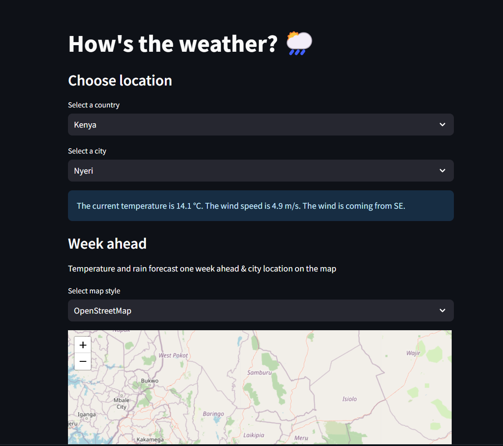

Your README is already well-structured, but I can help polish it to ensure clarity and readability. Here’s a refined version:

```markdown
# Streamlit Weather App

## Overview
  <!-- Add this line to include the image preview -->

This Streamlit-based web application provides real-time and forecasted weather data for over 40,000 cities worldwide. It offers historical weather data, city comparisons, and engaging visualizations to enhance the user experience. The app is designed to be interactive and user-friendly, featuring customizable forecasts, historical data views, and weather comparisons.

## Features

- **Current Weather**: Displays the current temperature, wind speed, and wind direction.
- **Weekly Forecast**: Shows temperature and precipitation forecasts for the upcoming week.
- **Historical Weather Data**: View and analyze historical weather data for a selected date range.
- **City Comparison**: Compare current weather conditions across multiple cities.
- **Weather Advice**: Recommendations on what to wear or do based on the current weather.
- **Temperature Animation**: Visualizes temperature changes over time with animation.
- **Local Time and Sun Times**: Displays local time, sunrise, and sunset times for the selected city.
- **Interactive Map**: Shows the selected city on an interactive map.

## Installation

To run this application locally, follow these steps:

1. **Clone the repository:**
   ```bash
   git clone https://github.com/yourusername/streamlit-weather-app.git
   cd streamlit-weather-app
   ```

2. **Install required packages:**
   Create a virtual environment and install the dependencies using pip:
   ```bash
   python -m venv env
   source env/bin/activate  # On Windows use `env\Scripts\activate`
   pip install -r requirements.txt
   ```

3. **Download data files:**
   Ensure you have the `worldcities.csv` file in the same directory as your script. You can download it from [SimpleMaps](https://simplemaps.com/data/world-cities).

4. **Run the app:**
   ```bash
   streamlit run app.py
   ```

## Usage

1. **Select Location:**
   - Choose a country from the dropdown menu.
   - Select a city from the list of cities in the chosen country.

2. **Current Weather:**
   - View the current temperature, wind speed, and wind direction.

3. **Weekly Forecast:**
   - See temperature and precipitation forecasts for the next week.
   - View the city's location on an interactive map.

4. **Historical Weather Data:**
   - Select a start and end date to view historical weather data.
   - Visualize data using time series plots.

5. **Compare Weather Between Cities:**
   - Select multiple cities to compare their current weather conditions.

6. **Weather Advice:**
   - Get recommendations on what to wear or do based on the current temperature and wind speed.

7. **Temperature Animation:**
   - Watch an animation of temperature changes over time.

8. **Local Time and Sun Times:**
   - View the local time, sunrise, and sunset times for the selected city.

## Dependencies

- `streamlit`
- `pandas`
- `requests`
- `plotly`
- `folium`
- `streamlit-folium`
- `pytz`
- `timezonefinder`

## Contributing

Contributions are welcome! To contribute, please fork the repository and submit a pull request with your changes. Ensure that your changes are tested and documented.

## License

This project is licensed under the MIT License. See the [LICENSE](LICENSE) file for details.

## Contact

For any questions or feedback, please reach out to [charleschuru94@gmail.com](mailto:charleschuru94@gmail.com).

Enjoy exploring the weather with our app!
```
